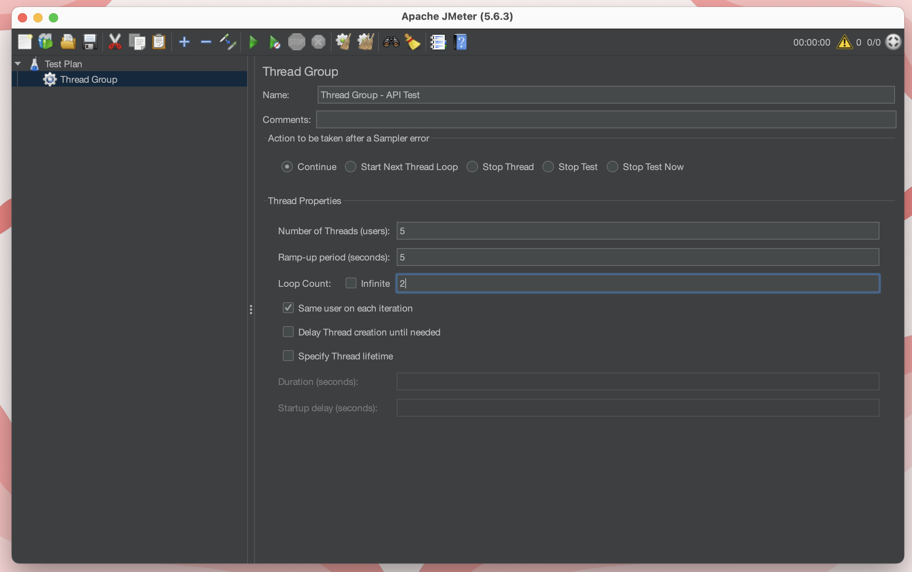
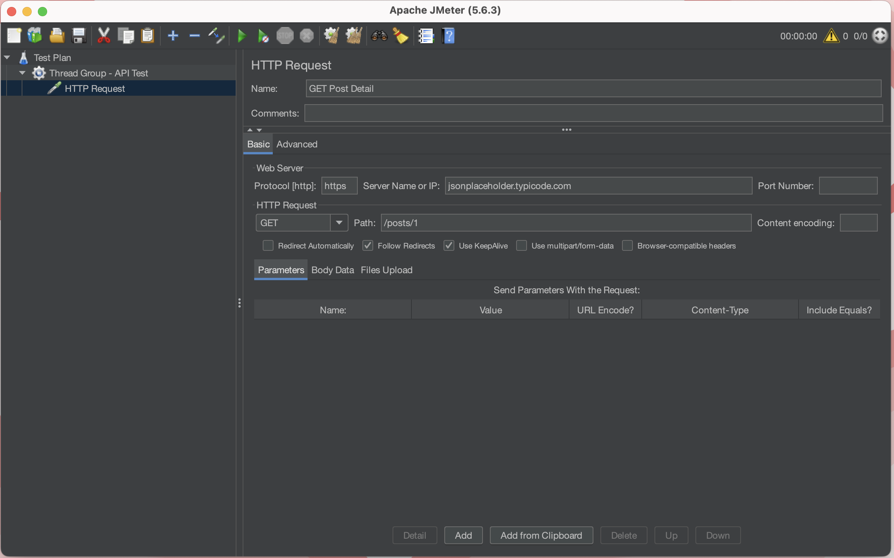
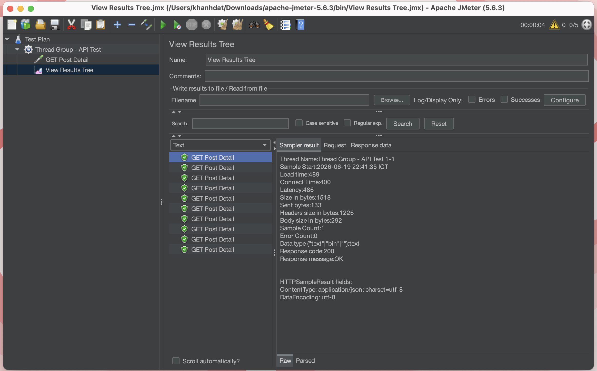
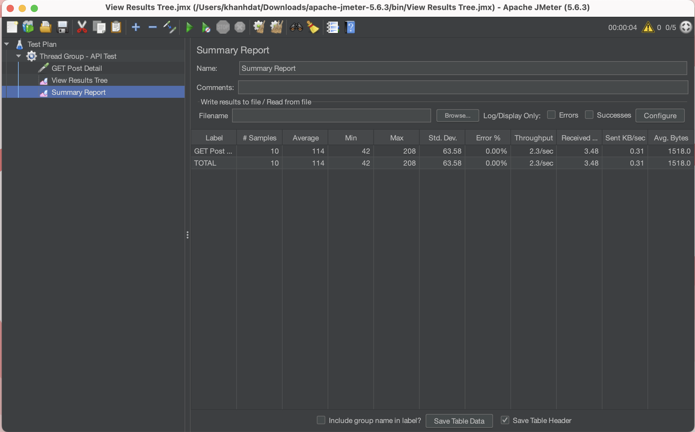

# Báo cáo tìm hiểu và kiểm thử hiệu năng bằng Apache JMeter

## 1. Giới thiệu

Apache JMeter là công cụ mã nguồn mở dùng để kiểm thử hiệu năng, kiểm thử tải và đo thời gian phản hồi của hệ thống. Công cụ này thường được sử dụng để kiểm thử website, API, web service và các hệ thống client-server.

Trong bài thực hành này, em sử dụng JMeter để kiểm thử một API công khai nhằm mô phỏng nhiều người dùng gửi request đồng thời và quan sát kết quả phản hồi của hệ thống.

## 2. Mục tiêu bài thực hành

* Tìm hiểu cách cài đặt và sử dụng Apache JMeter.
* Tạo Test Plan kiểm thử API bằng HTTP Request.
* Mô phỏng nhiều người dùng truy cập hệ thống.
* Quan sát kết quả kiểm thử bằng View Results Tree và Summary Report.
* Lưu lại hình ảnh minh họa quá trình thực hiện trên GitHub.

## 3. Công cụ sử dụng

| Công cụ             | Mục đích                       |
| ------------------- | ------------------------------ |
| Apache JMeter       | Tạo và chạy kịch bản kiểm thử  |
| Java JDK            | Môi trường chạy JMeter         |
| GitHub              | Lưu trữ bài nộp và báo cáo     |
| JSONPlaceholder API | API công khai dùng để kiểm thử |

## 4. API được kiểm thử

API sử dụng trong bài:

```text
GET https://jsonplaceholder.typicode.com/posts/1
```

Mục đích của API này là lấy thông tin một bài viết mẫu từ JSONPlaceholder.

## 5. Cấu hình kiểm thử

### 5.1 Thread Group

Cấu hình Thread Group:

| Thông số          | Giá trị |
| ----------------- | ------- |
| Number of Threads | 5       |
| Ramp-up Period    | 5 giây  |
| Loop Count        | 2       |

Với cấu hình trên, JMeter mô phỏng 5 người dùng, mỗi người gửi request 2 lần. Tổng số request được gửi là 10 request.

Ảnh minh họa:



### 5.2 HTTP Request

Cấu hình HTTP Request:

| Thành phần        | Giá trị                      |
| ----------------- | ---------------------------- |
| Protocol          | https                        |
| Server Name or IP | jsonplaceholder.typicode.com |
| Method            | GET                          |
| Path              | /posts/1                     |

Ảnh minh họa:



## 6. Kết quả kiểm thử

### 6.1 View Results Tree

View Results Tree hiển thị chi tiết từng request, bao gồm trạng thái phản hồi, mã phản hồi, thời gian phản hồi và dữ liệu trả về từ server.

Ảnh minh họa:



Kết quả cho thấy request trả về mã phản hồi 200, nghĩa là request đã được xử lý thành công.

### 6.2 Summary Report

Summary Report hiển thị kết quả tổng hợp của quá trình kiểm thử như số lượng request, thời gian phản hồi trung bình, min, max, throughput và tỉ lệ lỗi.

Ảnh minh họa:



## 7. Nhận xét kết quả

Sau khi chạy kiểm thử, các request gửi đến API đều trả về phản hồi thành công. Điều này cho thấy kịch bản kiểm thử đã được cấu hình đúng.

Với số lượng người dùng mô phỏng nhỏ, hệ thống phản hồi ổn định. Nếu muốn đánh giá khả năng chịu tải cao hơn, có thể tăng số lượng Threads, Loop Count hoặc thời gian Ramp-up.

## 8. Kết luận

Qua bài thực hành này, em đã hiểu được quy trình cơ bản để sử dụng Apache JMeter trong kiểm thử hiệu năng API. Em biết cách tạo Thread Group, cấu hình HTTP Request, chạy kiểm thử và đọc kết quả thông qua các Listener như View Results Tree và Summary Report.

JMeter là công cụ hữu ích trong kiểm thử phần mềm, đặc biệt trong việc đánh giá hiệu năng, thời gian phản hồi và khả năng chịu tải của hệ thống.

## 9. Tài liệu tham khảo

* Apache JMeter Documentation
* Apache JMeter User Manual
* JSONPlaceholder API
